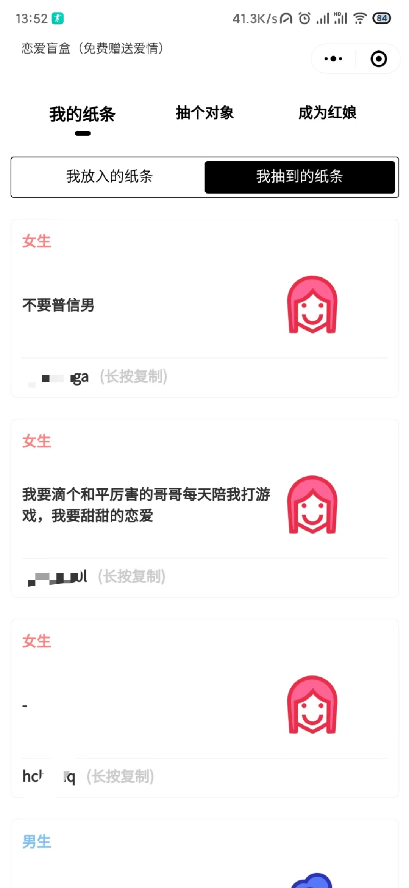
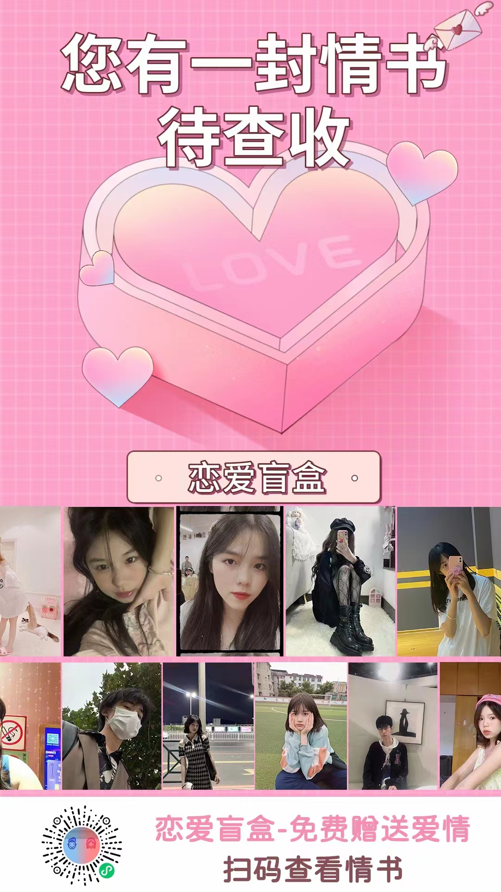

## 功能说明：
1. 全栈项目,微信小程序全后端一体源代码
2. 支持自定义首页轮播图广告推广
3. 支持流量主广告设置
4. 支持自定义导航功能
5. 邀请海报功能
6. 引导用户分享至朋友圈

## UI展示
<div style="display: flex;">
  
  
  
</div>

## 技术栈：
1. Vue2+uniApp（前端）
2. uniCloud云开发（后端）
3. 阿里云服务器免费
4. 支持二开

## 使用说明：
1. 安装依赖包

```js
  复制代码npm i
```
2. 在uniClound创建服务空间，并在“HBuilder”中进行关联，上传云开发相关依赖；
3. 运行微信小程序

## 在线体验


## 帮助
vx: LifeWenXin